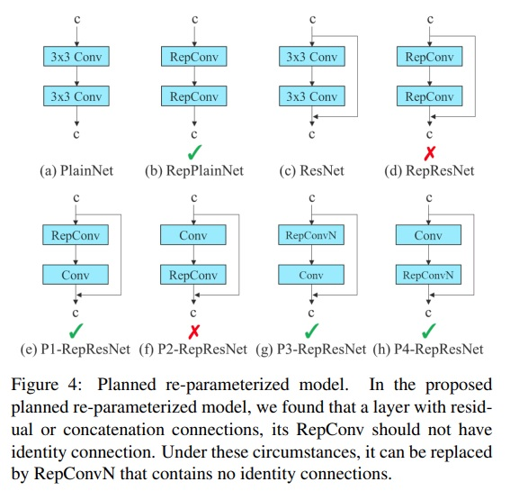
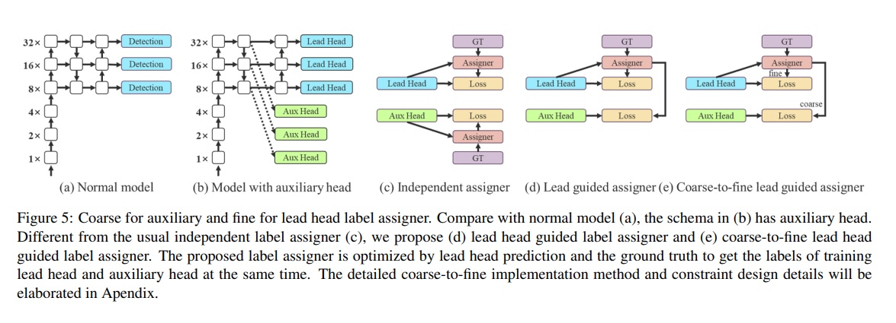
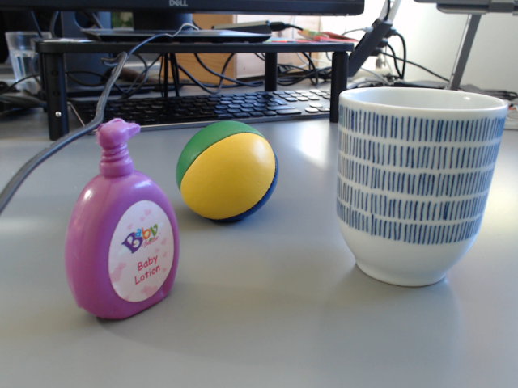
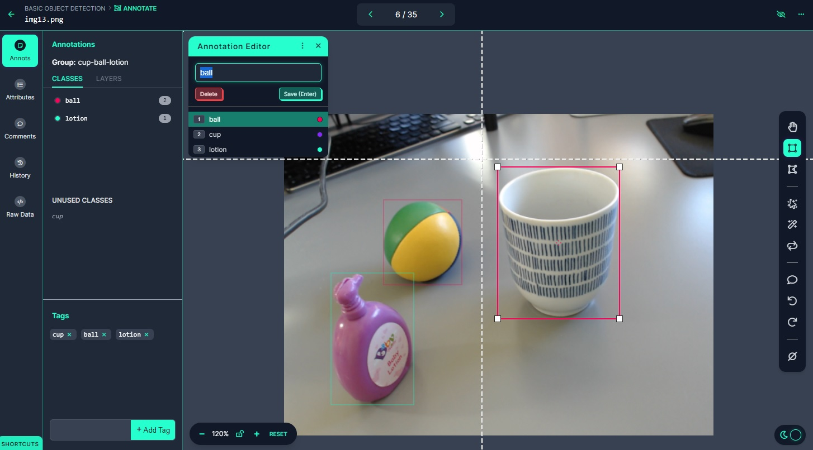

# Custom Object Detection with YOLO v7

I made these notes following these courses/tutorials by Nicolai Nielsen:

- [Nicolai Nielsen: YOLOv7 Custom Object Detection](https://nicolai-nielsen-s-school.teachable.com/courses)
- [Youtube: YOLO Object Detection Models, Nicolai Nielsen](https://www.youtube.com/playlist?list=PLkmvobsnE0GEfcliu9SXhtAQyyIiw9Kl0)
- [Fine Tuning YOLOv7 on Custom Dataset](https://learnopencv.com/fine-tuning-yolov7-on-custom-dataset/)
- [YOLOv7 Object Detection Paper Explanation & Inference](https://learnopencv.com/yolov7-object-detection-paper-explanation-and-inference/)

In addition to the content in those tutorials, I compiled information from other sources, as the YOLO v7 paper and repository.

Table of contents:

- [Custom Object Detection with YOLO v7](#custom-object-detection-with-yolo-v7)
  - [1. Introduction](#1-introduction)
  - [2. YOLOv7 Architecture](#2-yolov7-architecture)
    - [Efficient Layer Aggregation](#efficient-layer-aggregation)
    - [Model Scaling Techniques](#model-scaling-techniques)
    - [Re-Parametrization Planning](#re-parametrization-planning)
    - [Auxiliary Head](#auxiliary-head)
  - [3. Getting a Custom Dataset](#3-getting-a-custom-dataset)
    - [Capturing a Custom Dataset with OpenCV](#capturing-a-custom-dataset-with-opencv)
    - [Finding a Public Dataset](#finding-a-public-dataset)
    - [Labelling on Roboflow](#labelling-on-roboflow)
    - [Generate the Dataset: Preprocessing and Augmentation](#generate-the-dataset-preprocessing-and-augmentation)
    - [Exporting the Dataset](#exporting-the-dataset)
  - [4. YOLO v7 Repository: Notes](#4-yolo-v7-repository-notes)
  - [5. Training](#5-training)
  - [6. Deployment](#6-deployment)

## 1. Introduction

The original YOLO v7 paper is implemented in the following repository:

[WongKinYiu/yolov7](https://github.com/WongKinYiu/yolov7)

The code in that repository is used, after cloning it to [`lab/`](./lab/). Also, the pre-trained weights from that repo are used.

General requirements:

- [Roboflow](https://roboflow.com) account
- Anaconda
- Google Colab / Jupyter
- Python 3.9
- PyTorch (the newest version on Google Colab)
- OpenCV (all versions can be used, e.g., 4.5.2)
- Onnx runtime

Basic setup:

```bash
# Crate env: requirements in conda.yaml
# This packages are the basic for Pytorch-CUDA usage
# HOWEVER, we need to install more later on
# when we clone and use the  original YOLO v7 repo
conda env create -f conda.yaml
conda activate yolov7

# Pytorch: Windows + CUDA 11.7
# Update your NVIDIA drivers: https://www.nvidia.com/Download/index.aspx
# I have version 12.1, but it works with older versions, e.g. 11.7
# Check your CUDA version with: nvidia-smi.exe
# In case of any runtime errors, check vrsion compatibility tables:
# https://github.com/pytorch/vision#installation
# The default conda installation command DID NOT WORK
conda install pytorch=1.12 torchvision=0.13 torchtext=0.13 torchaudio pytorch-cuda=11.7 -c pytorch -c nvidia
# But the following pip install comman DID WORK
python -m pip install torch==1.13+cu117 torchvision==0.14+cu117 torchaudio torchtext==0.14 --index-url https://download.pytorch.org/whl/cu117

# Pytorch: Mac / Windows CPU (not tested)
python -m pip install torch torchvision torchaudio

# Dump installed libraries in pip format
python -m pip list --format=freeze > requirements.txt
```

In case of any runtime errors, check the torch-torchvision compatibility table: [](https://github.com/pytorch/vision#installation).

## 2. YOLOv7 Architecture

A concise explanation of **Object Detection** techniques is given in the [`README.md`](../README.md) from the upper level. Additionally, here some relevant links:

- [YOLOv7 Object Detection Paper Explanation and Inference](https://learnopencv.com/yolov7-object-detection-paper-explanation-and-inference/)
- [Fine Tuning YOLOv7 on Custom Dataset](https://learnopencv.com/fine-tuning-yolov7-on-custom-dataset/)
- [Deep Learning for Object Detection: A Comprehensive Review](https://towardsdatascience.com/deep-learning-for-object-detection-a-comprehensive-review-73930816d8d9)
- [Paper - YOLOv7: Trainable bag-of-freebies sets new state-of-the-art for real-time object detectors](https://arxiv.org/abs/2207.02696)

Main elements of the architecture:

- Backbone: feature extractor; we get feature maps of different sizes, all of a lower dimensionality.
- Feature Pyramid Network (FPN): we pass the feature maps to it; it has a pyramid-like structure, so features of different sizes are captured. The FPN seems to have routing / shortcuts.
- Heads: we have a head for each object/class allocation which predicts the object type and its bounding box.
- YOLO loss: each head has a YOLO loss with 3 components:
  - Cross-entropy, related to the class: `K` classes.
  - L1 loss, related to the bounding box: 4 values (`x, y, w, h`) 
  - Objectness loss: 1 value.


In the following th emost important 

### Efficient Layer Aggregation

Extended efficient layer aggregation networks are used (E-ELAN), which increase the group cardinality.  "Cardinality" refers to the number of groups in group convolution. Group convolution is a technique where the input channels are divided into groups, and each group is convolved with a separate filter. By doing so, the computation cost of convolution can be reduced. The output feature maps of each group are then concatenated to form the final output.

The authors of the paper propose an extension to this technique, called extended efficient layer aggregation networks (E-ELAN), which uses group convolution to increase the cardinality of the added features. This means that they increase the number of groups in group convolution to learn more diverse features. They then combine the features of different groups in a "shuffle and merge cardinality manner," which means that they randomly shuffle the output feature maps of each group and then concatenate them together.

This approach is intended to enhance the features learned by different feature maps and improve the use of parameters and calculations, ultimately leading to better object detection performance.


### Model Scaling Techniques

Model scaling is achieved by increasing/decreasng both the depth and the width of the network layers, i.e., modifzing the number of channels, among others. These the effect of:

- Having models of different numbers of parameters, i.e., sizes
- Having models of different accuracies and speeds, i.e., they can be better suited for specific applications (e.g., realtime or offline but with higher accuracy).


YOLO uses concatenation-base models. These, also known as multi-scale feature fusion models, are neural networks that combine features extracted at different spatial scales to improve object detection performance.

The authors propose a method for scaling concatenation-based models that involves increasing the number of channels in the network while maintaining a constant input resolution. This is intended to increase the expressive power of the network, allowing it to learn more complex and nuanced features that are better suited for object detection.

They also suggest increasing the depth of the network and adjusting the number of feature fusion layers to optimize the trade-off between model complexity and performance.

Overall, the idea of model scaling for concatenation-based models is to fine-tune the architecture of the network to achieve the best possible performance for the given task, taking into account factors such as computational efficiency and memory constraints.

### Re-Parametrization Planning

Re-Parametrization Planning is used, which consists in a technique for optimizing neural network architectures to improve efficiency and reduce redundancy, while maintaining or improving performance on the target task.

In traditional convolutional layers, each filter has a separate set of weights and biases for each input channel. This can lead to a large number of redundant parameters, particularly in deeper networks with many channels.

The authors propose a new type of convolutional layer that uses shared weights and biases across multiple channels. Specifically, they use a factorized weight matrix, where the filter weights are decomposed into two smaller matrices, one for the input channels and one for the output channels. This reduces the number of parameters needed to represent the convolutional filters, while still allowing the network to learn rich and diverse features.

The authors also introduce a method for dynamically adjusting the number of channels in the network based on the size of the input image. This allows the network to be more efficient when processing images of different sizes, without sacrificing accuracy.




### Auxiliary Head

YOLO v7 has a multi-headed architecture; in multi-head networks there is a separate head for each object class. Each head consists of a set of convolutional layers that process the features extracted by the backbone of the network, and then output the predicted bounding boxes and class probabilities for objects of that class.

In YOLOv7, the authors use a variant of this approach called "context-based multi-head," where the heads are organized according to the context of the object classes. This means that the heads for related object classes are grouped together, allowing them to share features and improve the accuracy of the predictions.

Additionally, **auxiliary heads** are used during **training**: smaller and shallower sub-network that are trained to predict intermediate features of the input image. The idea behind the auxiliary head is to provide additional supervision to the network during training, which can help to prevent overfitting and improve generalization performance.

During training, the loss function of the network is computed using both the predictions from the main head and the auxiliary head. The loss from the auxiliary head is weighted less than the loss from the main head, since the primary focus is still on predicting the bounding boxes and class probabilities.

At inference time, the auxiliary head is discarded, and only the main head is used to predict the final object detections.



## 3. Getting a Custom Dataset

### Capturing a Custom Dataset with OpenCV

The file [`record_images.py`](./lab/record_images.py) captures with the system camera images of a scene while we press `S`. We should place 4-5 objects on our desk and capure around 100 images (saved in [`./lab/data/captured/`](./lab/data/captured/)) while moving the camera/objects.

```python
import cv2

# Set camera: 0 default/laptop, 1 webcam, etc.
cap = cv2.VideoCapture(1)
# Initialize
num = 0
path = "data/captured"

while cap.isOpened():
    succes1, img = cap.read()
    k = cv2.waitKey(1)

    if k == 27: # ESC
        break
    elif k == ord('s'): # wait for 's' key to save and exit
        cv2.imwrite(path + '/img' + str(num) + '.png', img)
        print("image saved!")
        num += 1

    cv2.imshow('Img '+str(num), img)

cap.release()
cv2.destroyAllWindows()
```

I captured 35 images of three objects: a cup, a ball and a baby lotion toy. The images have a size of `(480, 640, 3)`.



### Finding a Public Dataset

We label the images using [Roboflow](https://roboflow.com). In that platform, it's possible to find public datasets once we log in:

    Universe > Object Detection: Select one dataset

For instance: [sakis2](https://universe.roboflow.com/project-coewi/sakis2/dataset/2).

We can:

- Browse the images and labels
- Use the loaded models, if any
- Download the dataset: as a ZIP or with an URL

When we select download, we need to select the label format; for the tutorial we use `TXT YOLOv7 Pytorch`.

If we choose the URL, we get a snippet like this, which allows for downloading the dataset to a local folder.

```python
!pip install roboflow

# Get API key:
# Projects > Settings > Roboflow API: Private API Key, Show
# Do not publish this key
# Alternatively, persist in local file, don't commit,
# and load from file
with open('roboflow.key', 'r') as file:
    api_key = file.read().strip()

# Download dataset to local folder
from roboflow import Roboflow
rf = Roboflow(api_key=api_key)
project = rf.workspace("project-coewi").project("sakis2")
# This will download to the local folder the dataset directory
# with the specified format
dataset = project.version(2).download("yolov7")
```

We can download the ZIP or via code, and then create a new project of our own and upload a dataset!

    Roboflow > Projects > Create new > Upload folder
      Car Detection

### Labelling on Roboflow

We can create a project and upload our images:

    Roboflow > Projects > Create new > Upload folder

After uploading the images, we need to annotate them:

- We assign a person (me)
- We start annotating with the interface



The Roboflow interface has these menus/pages:

    Universe Page / Upload / Assign / Annotate / Dataset / Generate / Versions / Deploy / Health Check

During annotation, we have the following tools:

- Hand, pick
- Box: we add a class name if new, select if already defined
- Polygon
- Smart polygon: automatic polygon segmentation
- Auto-labelling with existing pre-trained models, if the object classes are defined in, e.g., COCO
- Repeat previous: for video frames
- etc.

Then, we go back and `Add Images to Dataset`. The split is created.

We can check the `Health Check`, which gives relevant information on the dataset:

- Histograms of class instances
- Heatmaps
- Size information
- Several statistics
- etc.

### Generate the Dataset: Preprocessing and Augmentation

After we annotate the images, we need to explicitly **generate** the dataset. For that, we can add two steps:

- Preprocessing: Auto-Orient, Resize, etc.
- Augmentation: we have many image/bbox-level effects:
  - Flip
  - Rotate
  - Crop

If data augmentation and preprocessing are chosen, new images are generated, which can be downloaded later on. Thus, we don't need to create data loaders with transformers in the code.

### Exporting the Dataset

Once the dataset has been generated, we can train a model on Roboflow! However, we instead download the dataset and train our YOLOv7 model.

Under `Versions`, we select the version and `Export`.

- Select format: TXT YOLO v7
- Select python snippet

```python
rf = Roboflow(api_key=api_key)
project = rf.workspace("mikel-sagardia-tknfd").project("basic-object-detection-qkmda")
dataset = project.version(1).download("yolov7")
```

## 4. YOLO v7 Repository: Notes

The original YOLO v7 paper is implemented in the following repository:

[WongKinYiu/yolov7](https://github.com/WongKinYiu/yolov7)

The code in that repository is used, after cloning it to [`lab/`](./lab/). Also, the pre-trained weights from that repo are used.

I should probably spend some time having a look at the code, since it seems to be nicely done.

The repository has custom scripts that do all the job:

- [`train.py`](./lab/yolov7/train.py)
- [`test.py`](./lab/yolov7/test.py)
- [`detect.py`](./lab/yolov7/detect.py)

There are also many auxiliary scripts and tools for anything:

- [`models/yolo.py`](./lab/yolov7/models/yolo.py)
- `cfg`
- `tools`
- `utils`
- etc.

It seems that they use the Danknet configuration files, which are parsed and used to build the YOLO model with PyTorch.

## 5. Training

In the original repository, the authors explain how to use their scripts for training and inference.


## 6. Deployment

