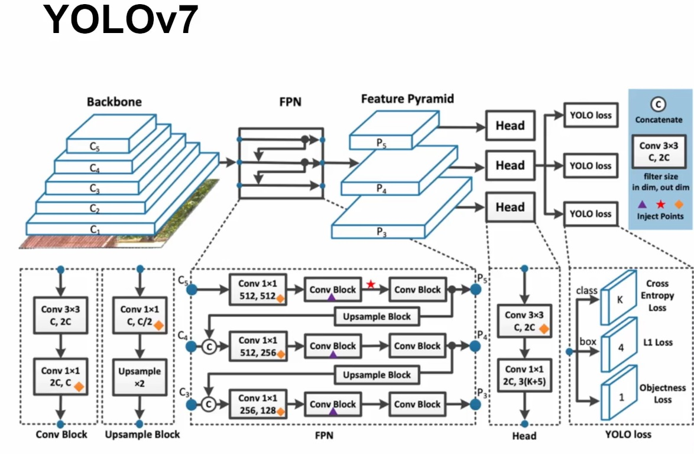
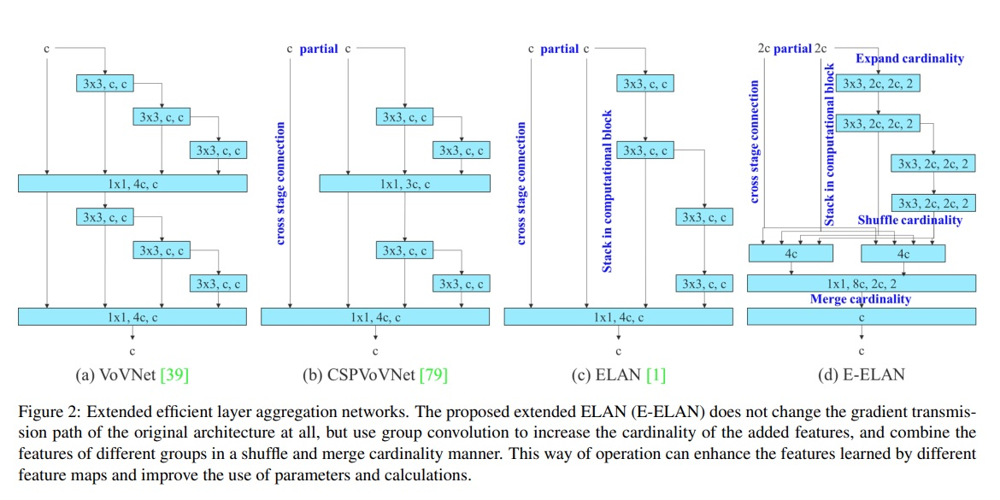
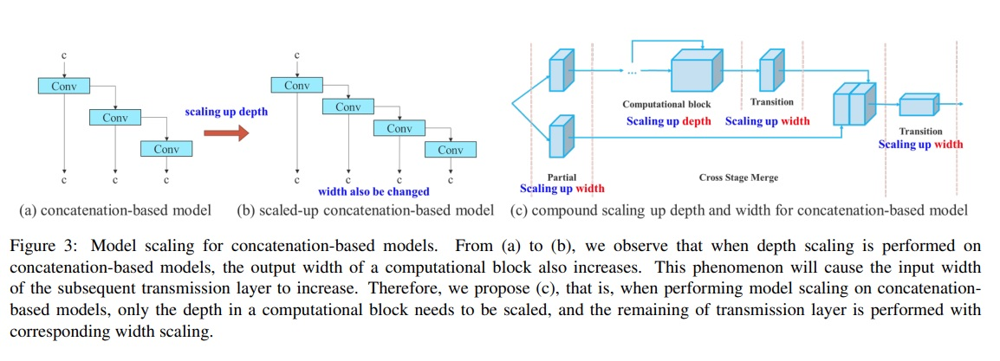

# Custom Object Detection with YOLO v7

I made these notes following these courses/tutorials by Nicolai Nielsen:

- [Nicolai Nielsen: YOLOv7 Custom Object Detection](https://nicolai-nielsen-s-school.teachable.com/courses)
- [Youtube: YOLO Object Detection Models, Nicolai Nielsen](https://www.youtube.com/playlist?list=PLkmvobsnE0GEfcliu9SXhtAQyyIiw9Kl0)

Table of contents:

- [Custom Object Detection with YOLO v7](#custom-object-detection-with-yolo-v7)
  - [1. Introduction](#1-introduction)
  - [2. YOLOv7 Architecture](#2-yolov7-architecture)
    - [Efficient Layer Aggregation](#efficient-layer-aggregation)
    - [Model Scaling Techniques](#model-scaling-techniques)
    - [Re-Parametrization Planning](#re-parametrization-planning)
    - [Auxiliary Head](#auxiliary-head)
  - [3. Custom Dataset](#3-custom-dataset)
  - [4. Training](#4-training)
  - [5. Deployment](#5-deployment)

## 1. Introduction

Requirements:

- [Roboflow](https://roboflow.com) account
- Anaconda
- Google Colab / Jupyter
- Python 3.9
- PyTorch (the newest version on Google Colab)
- OpenCV (all versions can be used, e.g., 4.5.2)
- Onnx runtime

Setup:

```bash
# Crate env: requirements in conda.yaml
conda env create -f conda.yaml
conda activate yolov7

# Pytorch: Windows + CUDA 11.7
# Update your NVIDIA drivers: https://www.nvidia.com/Download/index.aspx
# I have version 12.1, but it works with older versions, e.g. 11.7
# Check your CUDA version with: nvidia-smi.exe
conda install pytorch torchvision torchaudio pytorch-cuda=11.7 -c pytorch -c nvidia

# Pytorch: Mac / Windows CPU
python -m pip install torch torchvision torchaudio

# Dump installed libraries in pip format
python -m pip list --format=freeze > requirements.txt
```

## 2. YOLOv7 Architecture

A concise explanation of **Object Detection** techniques is given in the [`README.md`](../README.md) from the upper level. Additionally, here some relevant links:

- [YOLOv7 Object Detection Paper Explanation and Inference](https://learnopencv.com/yolov7-object-detection-paper-explanation-and-inference/)
- [Fine Tuning YOLOv7 on Custom Dataset](https://learnopencv.com/fine-tuning-yolov7-on-custom-dataset/)
- [Deep Learning for Object Detection: A Comprehensive Review](https://towardsdatascience.com/deep-learning-for-object-detection-a-comprehensive-review-73930816d8d9)
- [Paper - YOLOv7: Trainable bag-of-freebies sets new state-of-the-art for real-time object detectors](https://arxiv.org/abs/2207.02696)

Elements of the architecture:

- Backbone: feature extractor; we get feature maps of different sizes, all of a lower dimensionality.
- Feature Pyramid Network (FPN): we pass the feature maps to it; it has a pyramid-like structure, so features of different sizes are captured. The FPN seems to have routing / shortcuts.
- Heads: we have a head for each object/class allocation which predicts the object type and its bounding box.
- YOLO loss: each head has a YOLO loss with 3 components:
  - Cross-entropy, related to the class: `K` classes.
  - L1 loss, related to the bounding box: 4 values (`x, y, w, h`) 
  - Objectness loss: 1 value.



### Efficient Layer Aggregation

Extended efficient layer aggregation networks are used (E-ELAN), which increase the group cardinality.  "Cardinality" refers to the number of groups in group convolution. Group convolution is a technique where the input channels are divided into groups, and each group is convolved with a separate filter. By doing so, the computation cost of convolution can be reduced. The output feature maps of each group are then concatenated to form the final output.

The authors of the paper propose an extension to this technique, called extended efficient layer aggregation networks (E-ELAN), which uses group convolution to increase the cardinality of the added features. This means that they increase the number of groups in group convolution to learn more diverse features. They then combine the features of different groups in a "shuffle and merge cardinality manner," which means that they randomly shuffle the output feature maps of each group and then concatenate them together.

This approach is intended to enhance the features learned by different feature maps and improve the use of parameters and calculations, ultimately leading to better object detection performance.



### Model Scaling Techniques




### Re-Parametrization Planning


### Auxiliary Head

~~~~

## 3. Custom Dataset

## 4. Training

## 5. Deployment

