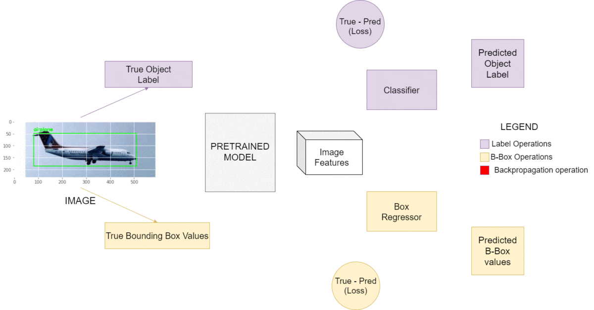

# PyImageSearch: Basic Object Detection with Pytorch

This folder contains examples/code from the following PyImageSearch tutorials:

1. [Object Detection with Pre-Trained Networks and PyTorch](https://www.pyimagesearch.com/2021/08/02/pytorch-object-detection-with-pre-trained-networks/?_ga=2.9215987.791523268.1684131076-844635163.1684131075)
2. [Training an object detector from scratch in PyTorch](https://pyimagesearch.com/2021/11/01/training-an-object-detector-from-scratch-in-pytorch/?_ga=2.72087509.791523268.1684131076-844635163.1684131075)

## Object Detection with Pre-Trained Networks and PyTorch

This section is implemented in [`01_pretrained/`](./01_pretrained/); the notebook [`pytorch_object_detection.ipynb`](./01_pretrained/pytorch_object_detection.ipynb) contains the implementation of the image detector.

The code performs object detection with 3 models pre-trained with COCO:

1. Faster R-CNN with a ResNet50 backbone (more accurate, but slower)
2. Faster R-CNN with a MobileNet v3 backbone (faster, but less accurate)
3. RetinaNet with a ResNet50 backbone (good balance between speed and accuracy)

We can pass any image to it **of any size** and if there are COCO objects in it, they will be detected and a rectangle will be drawn for each of them; note that we can have several objects per image! We have two implementations in scripts:

- Static images can be passed: [`detect_image.py`](./01_pretrained/pytorch-object-detection/detect_image.py); this is equivalent to the notebook code.
- A video stream can be passed and the objects are detected in real time: [`detect_realtime.py`](./01_pretrained/pytorch-object-detection/detect_realtime.py); this is a modification of the previous file to work with video streams. The speed is not great (approximately 2.42 FPS on CPU), but is works!

Material links:

- [Google Colab](https://colab.research.google.com/drive/1y5SG2llJOP5Nj4Felbmfl7wIJWKCxjQv?usp=sharing)
- [Code](https://pyimagesearch-code-downloads.s3-us-west-2.amazonaws.com/pytorch-object-detection/pytorch-object-detection.zip)
- [Blog post](https://pyimagesearch.com/2021/08/02/pytorch-object-detection-with-pre-trained-networks/?_ga=2.9215987.791523268.1684131076-844635163.1684131075)

Dependecies:

```bash
# Create an environment
conda env create -f conda_ds.yaml
conda activate ds

# Otherwise, if we are using any other standard environment
# we can simply install these
pip install torch torchvision
pip install opencv-contrib-python
```

Project structure:

```
.
|-- pytorch-object-detection/
|   |-- coco_classes.pickle             # Pickle with the 91 COCO classes ordered correctly
|   |-- detect_image.py                 # Main detection code
|   |-- detect_realtime.py              # Realtime detection
|   `-- images                          # Example images
|       |-- example_01.jpg
|       |-- example_02.jpg
|       |-- example_03.jpg
|       |-- example_04.jpg
|       |-- example_05.jpg
|       `-- example_06.jpg
`-- pytorch_object_detection.ipynb      # Code from detect_image.py
```

To run the project:

```bash
# Get package/code
conda activate ds
cd 01_pretrained
wget https://pyimagesearch-code-downloads.s3.us-west-2.amazonaws.com/pytorch-object-detection/pytorch-object-detection.zip
unzip -qq pytorch-object-detection.zip
cd pytorch-object-detection

# Option 1: Run ready script
# We can change the image or the model, among others - look at args!
python detect_image.py -i images/example_01.jpg
python detect_image.py --model frcnn-resnet --image images/example_06.jpg --labels coco_classes.pickle

# Option 3: Open and run the jupyter notebook
# Same code as in detect_image.py + MY NOTES
jupyter notebook pytorch_object_detection.ipynb
```

My notes are in the comments of the notebook: [01_pretrained/pytorch_object_detection.ipynb](./01_pretrained/pytorch_object_detection.ipynb).

## Training an object detector from scratch in PyTorch

This section is implemented in [`02_trained/`](./02_trained/); the notebook [`object_detector_in_pytorch.ipynb`](./02_trained/object_detector_in_pytorch.ipynb) contains the implementation.

Material:

- [Google Colab](https://colab.research.google.com/drive/1y4zjPK8AsVO7i-wziO9ZSIkrPGbOAS71?usp=sharing)
- [Code](https://pyimagesearch-code-downloads.s3-us-west-2.amazonaws.com/object-detector-in-pytorch/object-detector-in-pytorch.zip)
- [Blog post](https://pyimagesearch.com/2021/11/01/training-an-object-detector-from-scratch-in-pytorch/?_ga=2.72087509.791523268.1684131076-844635163.1684131075)We have only one object in an image; that's a 

The architecture of the implemented model is the following:

- The pre-trained ResNet50 network is used as backbone, with weights frozen.
- To the backbone, we attach two networks in parallel: one for regressing the bounding boxes, one for the classification labels.
- We assume we have only one object in an image; that's an important limitation, but the motivation of the network is educational; the model is defined and trained from-scratch using pre-trained weights of the backbone.

