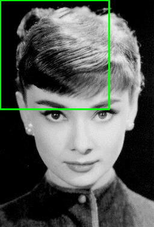

# PyImageSearch: R-CNN with Tensorflow

This mini-project is a series of 4 tutorials in which a Region Proposal CNN is built from scratch. Both theory and practical aspects are visited. We see intuitively how we can go from classifiers to object detectors, passing through different stages:

- Image pyramids and window sliding is applied to feed cropped patches to a CNN classifier.
- Selective search is introduced, as a replacement for image pyramids + window sliding.
- R-CNN implementation: first, a CNN is fine-tuned for desired classes, then, regions from selective search are passed to it for inference.

The fourth tutorial and notebook are the final application: after fine-tuning a CNN on desired objects, we are able to build an object detector which predicts an arbitrary amouont of specified objects in the scene.

These are the related blog posts:

1. [Turning Any Deep Learning Image Classifier into an Object Detector](https://pyimagesearch.mykajabi.com/products/pyimagesearch-university-full-access-plan/categories/4727361/posts/2147742271)
2. [OpenCV Selective Search for Object Detection](https://pyimagesearch.com/2020/06/29/opencv-selective-search-for-object-detection/?_ga=2.24076154.1576899293.1684317349-844635163.1684131075)
3. [Region proposal object detection with OpenCV, Keras, and TensorFlow](https://pyimagesearch.com/2020/07/06/region-proposal-object-detection-with-opencv-keras-and-tensorflow/?_ga=2.36462432.1576899293.1684317349-844635163.1684131075)
4. [R-CNN object detection with Keras, TensorFlow, and Deep Learning](https://pyimagesearch.com/2020/07/13/r-cnn-object-detection-with-keras-tensorflow-and-deep-learning/?_ga=2.195976428.1576899293.1684317349-844635163.1684131075)

The associated notebooks which contain all the code are the following:

1. [`classifier_to_detector.ipynb`](./classifier_to_detector.ipynb)
2. [`opencv_selective_search.ipynb`](./opencv_selective_search.ipynb)
3. [`region_proposal_object_detection.ipynb`](./region_proposal_object_detection.ipynb)
4. [`training-rcnn-keras.ipynb`](./training-rcnn-keras.ipynb)

## 1. Turning any CNN image classifier into an object detector with Keras, TensorFlow, and OpenCV

Material:

- [Blog post](https://www.pyimagesearch.com/2020/06/22/turning-any-cnn-image-classifier-into-an-object-detector-with-keras-tensorflow-and-opencv/?_ga=2.36459488.1576899293.1684317349-844635163.1684131075)
- [Google Colab](https://colab.research.google.com/drive/1MrgG83e-XGSEKlVLrHB7gT1tJ5PHeu-m?usp=sharing)
- [Code](https://pyimagesearch-code-downloads.s3-us-west-2.amazonaws.com/classifier-to-detector/classifier-to-detector.zip)

In this section/mini-project a pre-trained CNN (or any classifier) is converted into an object detector using **image pyramids** and **sliding windows**. The first allow for a multi-scale representation on which ROIs of different sizes are slided; for each capture image patch, a classifier is run (a CNN, linear SVM, etc.).

As the window gets closer to a learned object, the probabilities increase; up from a threshold, we take the proposal as valid. This approach is similar to what is done by **HOG, Histogram Oriented Gradients** or **Haar Cascades**.

When we use sliding windows, end up with many overlapping regions. We can collapse all these ROIs with **non-maximal supression** applied class-wise (see explanation in main `README.md`).

All this approach is a first approximation with which we can convert any classification network to be an object detection network; however, the resulting model has important limitations:

- It is very slow: we need to generate many image patches and run the classifierin all of them.
- It is constrained to the chosen window size/shape; that could be extended, but we'd require much more time.
- Bouding box locations are not accurate.
- The network is not end-to-end trainable: we train the classifier, but the bounding box detection algorithm is not trained!





We can run the notebook [`classifier_to_detector.ipynb`](./classifier_to_detector.ipynb) or the provided python script [`detect_with_classifier.py`](./classifier-to-detector/detect_with_classifier.py):

```bash
conda activate ds
cd classifier-to-detector

# Script
python detect_with_classifier.py --image images/hummingbird.jpg --size "(250, 250)"

# Notebook
cd ..
jupyter lab classifier_to_detector.ipynb
```

## 2. OpenCV Selective Search for Object Detection

Material:

- [Blog post](https://www.pyimagesearch.com/2020/06/29/opencv-selective-search-for-object-detection/?_ga=2.258874826.1576899293.1684317349-844635163.1684131075)
- [Google Colab](https://colab.research.google.com/drive/1irBEGter1EPoPTIIMrNkJKMWLeZZhOFP?usp=sharing)
- [Code](https://pyimagesearch-code-downloads.s3-us-west-2.amazonaws.com/opencv-selective-search/opencv-selective-search.zip)

This mini-project starts adressing the limitations of the previous approach: (1) slow computation due to a search in a large space and (2) fixed window shape. To that end, **selective search** is introduced: basically, we use classical algorithms on the image to detect probably interesting ROIs which are passed to the CNN, instead of sliding windows of different sizes, which is a brute force apprach.

The [Selective Search](http://www.huppelen.nl/publications/selectiveSearchDraft.pdf) algorithm was proposed in 2012 and it can replace any pryramid+sliding algorithm, being much faster. It oversegments an image and takes those small segments are ROIs.

Oversegmentation is like a tesselation of an image based on

- Color similarity.
- Texture similarity.
- Size similarity. 
- Shape similarity
- A final meta-similarity, which is a linear combination of the above similarity measures

The idea is that we compute [super-pixels](https://pyimagesearch.com/tag/superpixel/) on an image (similar cells) and then build a hirarchy upwards depending on cell similarities.

- Color similarity: channel histograms are compared.
- Texture similarity: derivatives in different orientations are compared.
- Size similarity: the merging of smaller regions is prioritized.
- Shape similarity: gap filling.
- A final meta-similarity, which is a linear combination of the above similarity measures

As we build the hierarchy, objects start to appear in the image; effectively, we pass intermediate clusters to the network. Those clusters are contained by proposed ROIs, which are used to crop image patches passed to the CNN.


Thus, selective search is similar to [saliency detection](https://pyimagesearch.com/2018/07/16/opencv-saliency-detection/): regions are identified which could contain objects.

The contributions package of OpenCV has a built-in module which performs automatically selective search; that's what is shown in the code.

We can run the notebook [`opencv_selective_search.ipynb`](./opencv_selective_search.ipynb) or the provided python script [`selective_search.py`](./opencv-selective-search/selective_search.py):

```bash
conda activate ds
cd classifier-to-detector

# Script
python selective_search.py --image dog.jpg 

# Notebook
cd ..
jupyter lab opencv_selective_search.ipynb
```

Interesting links:

- [Selective Search poster](https://www.koen.me/research/pub/vandesande-iccv2011-poster.pdf)
- [Saliency detection](https://pyimagesearch.com/2018/07/16/opencv-saliency-detection/)

## 3. Region proposal object detection with OpenCV, Keras, and TensorFlow

Material:

- [Blog post](https://www.pyimagesearch.com/2020/07/06/region-proposal-object-detection-with-opencv-keras-and-tensorflow/?_ga=2.201152622.1576899293.1684317349-844635163.1684131075)
- [Google Colab](https://colab.research.google.com/drive/15S6aRDKMlCNckEFmJ5dV1Ss307syZJAw?usp=sharing)
- [Code](https://pyimagesearch-code-downloads.s3-us-west-2.amazonaws.com/region-proposal-object-detection/region-proposal-object-detection.zip)

In this mini-project, the *selective search* code from the previous section is used to replace the window sliding from the first section; that way, we convert a CNN into an object detector, as done at the beginning, but using proposed regions, which reduces considerably the search space. This is very similar to the approach presented in the original R-CNN paper by Girschick et al.

Converting a classifier into an object detector has an additional advantage: we don't need to annotate the objects with boundig boxes! It's enough to label the images!

Using a general pre-trained network has also a drawback: we get a lot of noise in the form of detection of undesired objects. A solution to that is fine-tuning a pre-trained network to detect only the objects we are interested in. That's what is done in the next mini-project.

We can run the notebook [`region_proposal_object_detection.ipynb`](./region_proposal_object_detection.ipynb) or the provided python script [`region_proposal_detection.py`](./region-proposal-object-detection/region_proposal_detection.py):

```bash
conda activate ds
cd region-proposal-object-detection

# Script
python region_proposal_detection.py --image beagle.png

# Notebook
cd ..
jupyter lab region_proposal_object_detection.ipynb
```

## 4. R-CNN object detection with Keras, TensorFlow, and Deep Learning

Material:

- [Blog post](https://pyimagesearch.com/2020/07/13/r-cnn-object-detection-with-keras-tensorflow-and-deep-learning/?_ga=2.195976428.1576899293.1684317349-844635163.1684131075)
- [Google Colab](https://colab.research.google.com/drive/1LWj7-xWnj2LYDfqLjbXVapB2l4fl31Z0?usp=sharing)
- [Code](https://pyimagesearch-code-downloads.s3-us-west-2.amazonaws.com/training-rcnn-keras/training-rcnn-keras.zip)

This mini-project fine-tunes a pre-trained CNN to detect only one object (a racoon) and applies selective search, similarly as done in the original R-CNN paper by Girschik et al. Basically, the previous section is re-framed in a more production-like code.

The dataset is quite small (200 images + XML bbox annotations), and was originally compiled by [Dat Tran](https://dat-tran.com/):

```
racoons/
|-- annotations/
|   |-- raccoon-1.xml
|   |-- ...
|   `-- raccoon-200.xml
|-- images/
|   |-- raccoon-1.jpg
|   |-- ...
|   `-- raccoon-200.jpg
```

However, the dataset is amplified using selective search: interesting regions proposed by the algorithm are checked for overlap with the ground truth; if the overlap is considerable, a cropped image patch is generated and stored in `dataset/racoon`, if not in `dataset/no_racoon`:

```
dataset
.
|-- no_raccoon
|   |-- 0.png
|   `-- 1559.png
|-- raccoon
|   |-- 0.png
|   `-- 2199.png
```

The complete pipeline is the following:

1. Build object detection dataset with Selective Search
    - Take 200 images + XML
    - Parse XML with BeautifulSoup
    - Run selective search on each of the images
    - Take the regions of the selective search and see if they overlap considerably with ground truth from XML; if so, crop image patch and save to `racoon` folder, otherwise crop image and save to `no_racoon` folder
2. Fine-tune classification model on created dataset
    - Use the `racoon` and `no_racoon` images to fine-tune a pre-trained CNN.
    - A final classifier with 2 outputs is added to the MobileNet.
    - The backbone (MobilNet) is frozen, only the weights of the classifier are trained with the generated dataset.
    - Data augmentation is used.
3. During inferene, run selective search on input image
    - ROIs of the selective search are passed to the fine-tuned model.
4. Predict with fine-tuned model on proposed region
    - Only predictions with a high confidence (`0.99`) are taken.
5. Apply Non-maximal Supression
6. Return final object detection results

Note that with this implementation, we still don't train the model to predict bounding boxes (i.e., bounding box regression), but we take the ROIs from selective search.


We can run the notebook [`training_rcnn_keras.ipynb`](./training_rcnn_keras.ipynb) or the provided python scripts in [`training-rcnn-keras/`](./training-rcnn-keras):

```bash
conda activate ds
cd training-rcnn-keras

# Script
python build_dataset.py
python fine_tune_rcnn.py
python detect_object_rcnn.py --image images/raccoon_01.jpg

# Notebook
cd ..
jupyter lab training_rcnn_keras.ipynb
```
