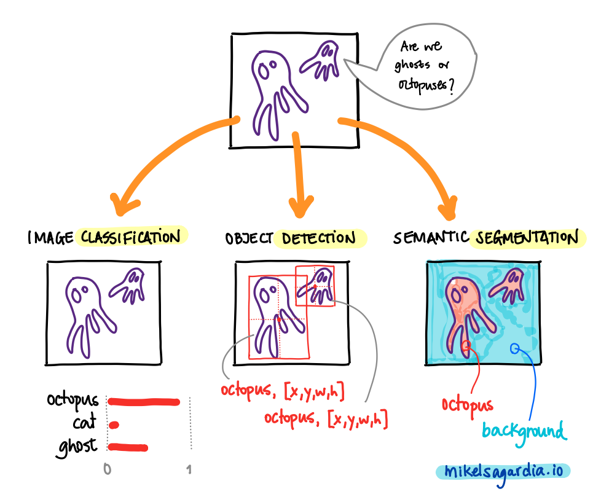
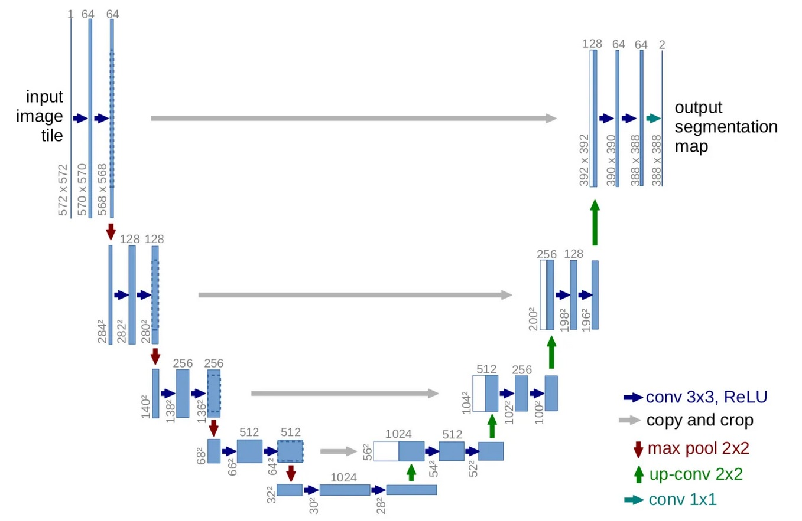

# Beyond Image Classification: Object Detection and Semantic Segmentation with Pytorch

This repository collects examples and resources in which [*Object Detection*](https://en.wikipedia.org/wiki/Object_detection) and [*Semantic Segmentation*](https://en.wikipedia.org/wiki/Image_segmentation) are applied to images with [Pytorch](https://pytorch.org/).

:warning: Important notes, first of all:

[](https://shields.io/#your-badge)

- This is an on-going project; I will extend the content as far as I have time for it.
- In some cases, I will use the code from other public tutorials/posts rightfully citing the source.
- In addition to the examples, the links in the section [Interesting Links](#interesting-links) are very useful resources for those interested in the topic.

## Introduction

Probably the most known application of Convolutional Neural Networks is *Image Classification*: an image is convoluted with several trained filters to output a vector of `N` values; each value is a float between `0` and `1` and it denotes the probability of the image containing one of the pre-defined `N` classes of objects.

However, there are also CNN architectures and methods that target other applications:

- Object Detection: given an image and a predefined set of `N` classes, we obtain the bounding boxes (typically `[x,y,w,h]` vectors) that enclose known object classes, and for each bounding box, a vector of length `N` which determines the probabilities of each class, as in image classification.
- Semantic Segmentation: given an image and a predefined set of `N` classes, we obtain the `N` class probabilities for each pixel; i.e., we can segment regions in the images.

The following figure illustrates the difference between the three techniques:



As mentioned, this repository collects practical examples that target the last two applications.

### Table of Contents
- [Beyond Image Classification: Object Detection and Semantic Segmentation with Pytorch](#beyond-image-classification-object-detection-and-semantic-segmentation-with-pytorch)
  - [Introduction](#introduction)
    - [Table of Contents](#table-of-contents)
  - [How to Use This](#how-to-use-this)
    - [Dependencies](#dependencies)
  - [Object Detection: General Notes](#object-detection-general-notes)
    - [Faster R-CNN](#faster-r-cnn)
    - [Intersection Over Union: IOU](#intersection-over-union-iou)
    - [YOLO: You Only Look Once](#yolo-you-only-look-once)
    - [Metrics](#metrics)
    - [Model Selection](#model-selection)
  - [Semantic Segmentation: General Notes](#semantic-segmentation-general-notes)
  - [List of Examples + Description Points](#list-of-examples--description-points)
  - [Some Statistics](#some-statistics)
  - [Improvements and Possible Extensions](#improvements-and-possible-extensions)
  - [Interesting Links](#interesting-links)
  - [Authorship](#authorship)

## How to Use This

1. Go to the desired example folder from the section [List of Examples + Description Points](#list-of-examples--description-points). You should have brief instructions in each folder.
2. If there is an `Open in Colab` button anywhere, you can use it :smile:.
3. If you'd like to run the code locally on your device install the [dependencies](#dependencies) and run the main file in it; often, the main file will be a notebook that takes care of all.

### Dependencies

You should create a python environment (e.g., with [conda](https://docs.conda.io/en/latest/)) and install the dependencies listed in the [requirements.txt](requirements.txt) file of each example. If there is no such file in a folder example, the one in the root level should work.

A short summary of commands required to have all in place is the following; however, as mentioned, **each example might have its own specific dependency versions**:

```bash
conda create -n det-seg python=3.6
conda activate det-seg
conda install pytorch torchvision -c pytorch 
conda install pip
pip install -r requirements.txt
```

## Object Detection: General Notes

In this section, I provide some high level notes on the theory behind the object detection networks; for more details, check the articles listed in the [literature](literature) folder.

Object detection networks can use classification backbones to extract features, but at the end of the feature extractor, instead of mapping the activations to classes, they perform a more sophisticated tasks, with which they basically:

- regress Regions of Interest (ROI), i.e., bounding boxes, that likely contain an object
- and yield class probabilities for those bounding boxes.

A naive implementation could add two branches to the feature maps: one for regressing the `[x,y,w,h]` floats of the bounding box and another one for mapping the features to the class probabilities. However, that allows a unique object to be detected in the image; thus, more sophisticated architectures are needed, which nonetheless, are based on that double mapping principle.

### Faster R-CNN

One type of architecture for object detection is **Region-CNN**, or **R-CNN**; there are several versions of it, but the one typically used (due to its performance) is the **Faster R-CNN**.

The **Faster R-CNN** network has the following steps:

- The image is convoluted until a given layer, which produces a set of feature maps.
- We feed the feature maps to a separate network which predicts possible ROIs: these are called **Region Proposal Networks**; if edges or other relevant features have been detected, ROIs that enclose them will emerge.
- The ROI proposals are passed to the original network, which performs a quick binary check: does the ROI contain an object or not? If so, the ROI is taken.
- For each ROI, ROI pooling is performed: non-uniform cells of pooling are applied to warp the ROIs to standard sizes
- The last part of the network predicts the class of the ROI.

The main difference between the R-CNN architectures lies on the ROI detection: less efficient networks project ROIs computed after applying classical algorithms, while the Faster R-CNN uses a Region Proposal Network.

Region proposal networks work as follows:

- A small (usually 3x3) window is slided on the feature maps.
- `k` anchor boxes are applied on each window. These anchor boxes are pre-defined boxes with different aspect ratios.
- For each `k` boxes in each window, the probability of it containing an object is measured. If it's higher than a threshold, the anchor box is suggested as a ROI.

During training, the ground truth is given by the real bounding box: if the suggested ROI overlaps considerably with a true bounding box, the suggestion is correct.

The following image gives an overview of the major steps in Faster R-CNN:


### Intersection Over Union: IOU

The metric used in object detection to evaluate the quality of the bounding boxes is the **intersection over union** or **IOU** ratio, computed with the intersection and union areas of the predicted and ground truth bounding boxes. Ideally, the value should be 1.


### YOLO: You Only Look Once

Two important alternatives to Faster R-CNN are:

- YOLO: You Only Look Once
- SSD: Single Shot Detection

YOLO works in realtime; it prioritizes fast object detection and it can be used in applications such like self-driving cars.

YOLO achieves that speed with the the following properties:

- We don't have a sliding window, but the image is tesselated in a grid and each cell is analyzed.
- The regression and classification problems are united into a simultaneous regression.

In other words, we predict for each cell `(i,j)` in the grid the following vector:

`g_ij = [p_c, c_1, c_2, c_3, x, y, w, h]`, where

- `p_c = [0,1]`: probability of the box of containing an object (*objectness*).
- `c_1, c_2, c_3`: probabilities of the object being of class 1, 2, 3; the number of classes varies depending on the problem definition.
- `x, y, w, h`: location and size of the bounding box.

Only bounding box and class values of cells that have high `p_c` values are considered; additionally, during training `p_c = 1` if and only if the cell contains the center of the ground truth object.


This approach yields many bounding box candidates for the same object, which come from adjacent grid cells. In order to filter them, **Non-Maximal Supression** is used; that works with the following steps:

1. Go through all cells and take the ones which have `p_c > nms_thres = 0.6` (or a value of choice).
2. Take the cell with the largest `p_c`.
3. Compute the IoUs of the other bounding boxes with respect to the one with the largest `p_c`.
4. Remove all bounding boxes which have a high IoU value, e.g., `IoU >= iou_thres = 0.4`.
5. Repeat from step 2 using the cells that are remaining.

Note that in case two different objects overlap, this algorithm would not work, since the overlapping object would default to one. For those cases, **anchor boxes** are used.

Anchor boxes consider that objects of different aspect ratios can overlap in the image (e.g., person and car); to deal with that, the length of the cell vector is multiplied by the number of allowed anchor boxes; if we have two anchor boxes:

`g_ij = [p_c, c_1, c_2, c_3, x, y, w, h, p_c, c_1, c_2, c_3, x, y, w, h]`

The first part belongs to the first anchor box or object and the last to the second. Basically, we add channels to the original classification map.

The final **YOLO v3** architecture has the following properties:

- The input size is 416 x 416 x 3
- The output size is 52 x 52 x 255
  - Grid: 52 x 52
  - Channels: 255; these contain the bounding box and class vectors
- There are 100+ layers!
  - Most of the layers are convolutions: 3x3, 1x1; number of filters vary: 32 - 1024 and pooling is applied every 2-3 convolutions.
  - There are shortcut and routing layers, too.

The examples contain also some other improved YOLO versions.

### Metrics

Object Detection uses as metric the **mean average precision, mAP**: The AP is the area under the curve of the precision-recall diagram (varying the detection threshold) for one class; the mAP is the mean across all classes:

- Precision: ratio of true positive detections to the total number of detection.
- Recall is the ratio of true positive detections to the total number of ground-truth objects.

The **Intersection over Union, IOU** metric is taken into account implicitly in the mAP, because we use a threshold IOU to denote whether a bounding box is a true/false positive:

- A predicted bounding box is considered a true positive if its IoU with a ground-truth bounding box is above a certain threshold (usually 0.5 or 0.75).
- If the IoU is below the threshold, the predicted bounding box is considered a false positive.
- If there are multiple predicted bounding boxes for a single ground-truth object, only the one with the highest IoU is counted as a true positive.

### Model Selection

Object detection is often deployed in realtime applications, for which we need to be able to perform the inference fast enough. In that sense, the introduced two model families have opposing properties:

- Faster R-CNN tend to be more accurate and slower.
- YOLO models tend to be faster and less accurate, thus better suited for realtime applications. However, it seems that the recent versions beat all possible models in terms of accuracy and speed.

There is a third family of models, which is a trade-off between YOLO and Faster R-CNN: there are the **Single Shot Detectors (SSD)**, see the [`literature`](./literature/). These is a comparison of the 3 models done by ChatGPT:

> 1. **Architecture Design:**
>    - YOLO: YOLO uses a single neural network to perform both object localization and classification. It divides the input image into a grid and predicts bounding boxes and class probabilities for each grid cell.
>    - SSD: SSD also uses a single network but employs a set of predefined anchor boxes at multiple scales and aspect ratios. It predicts offsets and confidence scores for these anchor boxes at different feature maps.
>    - Faster R-CNN: Faster R-CNN consists of two main components: a region proposal network (RPN) that generates potential object proposals, and a separate network that performs classification and bounding box regression on these proposals.
> 
> 2. **Speed vs. Accuracy Trade-off:**
>    - YOLO: YOLO is known for its real-time object detection capabilities due to its single-pass architecture. It sacrifices some accuracy for faster inference times.
>    - SSD: SSD strikes a balance between accuracy and speed by using multiple scales and aspect ratios of anchor boxes. It achieves better accuracy than YOLO but at the cost of slightly slower inference times.
>    - Faster R-CNN: Faster R-CNN is considered to be more accurate but slower compared to YOLO and SSD. Its two-stage approach of proposal generation and classification contributes to its higher accuracy.
> 
> 3. **Accuracy on Small Objects:**
>    - YOLO: YOLO struggles with detecting small objects due to the fixed grid structure and loss of spatial information at the later stages of the network.
>    - SSD: SSD performs relatively better than YOLO in detecting small objects because of its multiple anchor boxes at different scales.
>    - Faster R-CNN: Faster R-CNN performs well on small objects as it utilizes the region proposal network to generate accurate object proposals.
> 
> 4. **Training Approach:**
>    - YOLO: YOLO trains the network by optimizing both localization and classification losses directly. It considers objectiveness and class probabilities within each grid cell.
>    - SSD: SSD also optimizes localization and classification losses but uses default anchor boxes and matching strategies to assign ground truth objects to these anchors.
>    - Faster R-CNN: Faster R-CNN uses a two-stage training process. First, it trains the RPN to generate region proposals. Then, it fine-tunes the network using these proposals to perform classification and bounding box regression.

We need to consider also that we use a backbone or feature extractor in Faster R-CNN and SSD; in that sense, it is possible to choose lighter networks than the typical ResNets for the task. An option are **MobileNets** (see [`literature`](./literature/)), which add a `1x1` convolution after the typical `3x3` convolution, which reduces the number of parameters in the network. As a result, the models are smaller and faster — but less accurate; they are suited for deployment on edge devices.  

## Semantic Segmentation: General Notes

In this section, I provide some high level notes on the theory behind the semantic segmentation networks; for more details, check the articles listed in the [literature](literature) folder.

A very common architecture used for image segmentation is U-Net; the architecture was originally developed for medical applications, but quickly was adopted in other domains, such as autonomous driving. A nice introduction of the architecture is given by this blog post: [UNet - Line by Line Explanation](https://towardsdatascience.com/unet-line-by-line-explanation-9b191c76baf5).

When we perform semantic segmentation:

- The input and output image sizes are the same.
- We determine a class for each output pixel.

In particular, the U-Net architecture is summarized as follows:

- It has an encoder-decoder pipeline, aka. *contracting-expanding*:
  - The encoder compresses the size of the feature maps with convolution and pooling layers.
  - The decoder takes the final features and upscales them to the output image (i.e., the segmentation map) using transpose convolutions.
- The different encoder/decoder stages are linked with skip connections: we pass features from the encoder levels to the equivalent decoder levels. 



## List of Examples + Description Points

| Project | Method | Architecture | Framework | Inference | Training | Custom Objects | Annotations Done | Realtime |
| --- | --- | --- | --- | --- | --- | --- | --- | --- |
| [`01_mask_r_cnn_fine_tuning`](01_mask_r_cnn_fine_tuning) | R-CNN | Pytorch | Detection + Segmentation | :heavy_check_mark: | :heavy_check_mark: | :heavy_check_mark: | :x: | :x: |
| [`02_yolo_v3_darknet`](02_yolo_v3_darknet) | YOLO v3 | Darknet, Pytorch | Detection | :heavy_check_mark: | :x: | :x: | :x: | :x: |
| [`03_yolo_v7_tutorial`](03_yolo_v7_tutorial) | YOLO v7 | Pytorch | Detection | :heavy_check_mark: | :heavy_check_mark: | :heavy_check_mark: | :heavy_check_mark: | :heavy_check_mark: |
| [`05_unet_segmentation_pyimagesearch`](./05_unet_segmentation_pyimagesearch) | U-Net | Pytorch | Segmentation | :heavy_check_mark: | :heavy_check_mark: | :heavy_check_mark: | :x: | :x: |


- [`01_mask_r_cnn_fine_tuning`](01_mask_r_cnn_fine_tuning)
  - (Object) detection and segmentation of humans.
  - A custom data loader is defined for segmentation and detection.
  - An hybrid model is created which predicts the bounding box (Faster-RCNN) and segments the object in it (Mask-RCNN).
  - We have also examples about how to:
    - Use only Faster-RCNN for our custom classes
    - Use another backbone for faster inferences, e.g., MobileNet insteead of the default ResNet50.
  - Helper scripts are downloaded, which facilitate the training.
  - Training is performed and the model evaluated.

- [`02_yolo_v3_darknet`](02_yolo_v3_darknet)
  - Object detection.
  - A custom wrapper for YOLO-v3 is provided: a Pytorch model is created, darknet weights read and loaded into the model.
  - Only inference is possible, not training.
  - The COCO classes can be used only.

- [`03_yolo_v7_tutorial`](03_yolo_v7_tutorial)
  - Object detection.
  - YOLOv7 trial using the code from the original paper repository.
  - Main sources: 
    - [Nicolai Nielsen: YOLOv7 Custom Object Detection](https://nicolai-nielsen-s-school.teachable.com/courses)
    - [Youtube: YOLO Object Detection Models, Nicolai Nielsen](https://www.youtube.com/playlist?list=PLkmvobsnE0GEfcliu9SXhtAQyyIiw9Kl0)
    - [Original yolov7 implementation repository](https://github.com/WongKinYiu/yolov7)
  - A custom dataset is generated with the webcam and uploaded to [Roboflow](https://roboflow.com).
  - The dataset is labelled using Roboflow web UI; three objects: ball, cup, lotion.
  - The dataset is downloaded to local Windows.
  - YOLO v7 model is trained (fine-tuned) on Windows + eGPU NVIDIA RTX 3060 + Pytorch.
    - Weights and Biases is used to track the training.
  - The trained model is exported to ONNX.
  - The model (both Pytorch and ONNX) is run for online inference with webcam.

- [`04_basic_object_detection_pyimagesearch`](04_basic_object_detection_pyimagesearch)
  - [`01_pretrained`](./04_basic_object_detection_pyimagesearch/01_pretrained/)
    - [Blog post](https://pyimagesearch.com/2021/08/02/pytorch-object-detection-with-pre-trained-networks/?_ga=2.9215987.791523268.1684131076-844635163.1684131075)
    - We can pass any image to it **of any size** and if there are COCO objects in it, they will be detected and a rectangle will be drawn for each of them.
    - We can have several objects per image.
    - Apart from the notebook, we have two implementations in scripts:
      - Static images can be passed: [`detect_image.py`](./01_pretrained/pytorch-object-detection/detect_image.py); this is equivalent to the notebook code.
      - A video stream can be passed and the objects are detected in real time: [`detect_realtime.py`](./01_pretrained/pytorch-object-detection/detect_realtime.py); this is a modification of the previous file to work with video streams. The speed is not great (approximately 2.42 FPS on CPU), but is works!
  - [`02_trained`](./04_basic_object_detection_pyimagesearch/02_trained/)
    - [Blog post](https://pyimagesearch.com/2021/11/01/training-an-object-detector-from-scratch-in-pytorch/?_ga=2.72087509.791523268.1684131076-844635163.1684131075)
    - The pre-trained ResNet50 network is used as backbone, with weights frozen.
    - To the backbone, we attach two networks in parallel: one for regressing the bounding boxes, one for the classification labels.
    - We assume we have only one object in an image; that's an important limitation, but the motivation of the network is educational; the model is defined and trained from-scratch using pre-trained weights of the backbone.
    - A custom dataset loader is defined; it could be improved: it load all images together, but each could be opened every time we access it.
    - Overall I thinks it's a nice example to see how to implement things end-to-end, but we need to be aware of the **limitations**:
      - We have 3 custom objects, but:
        - The annotations are provided already.
        - The objects are quite similar to some COCO/ImageNet classes, nothing really weird: airplane, face, motorcycle.
      - A custom data loader is implemented to deal with the images and the annotations; the loader could be improved by openening images only when needed.
      - Only one object is detected in an image.
  - [`03_pretrained_opencv_caffe/`](./04_basic_object_detection_pyimagesearch/03_pretrained_opencv_caffe/)
    - This mini-project is similar to the project [`01_pretrained`](./01_pretrained/).
    - A pre-trained MobileNet SSD network saved as a Caffe binary is loaded with `cv2.dnn` and used for inference, without training.
    - The model is trained with COCO and fine-tuned with Pascal VOC (72.7% mAP); we can therefore detect 20 objects in images (+1 for the background class): airplanes, bicycles, birds, boats, bottles, buses, cars, cats, chairs, cows, dining tables, dogs, horses, motorbikes, people, potted plants, sheep, sofas, trains, tv monitors.
    - We can pass any image to the loaded network and if any of the listed objects are in it, they should be detected.
    - Multiple objects can be detected.
  - [`04_pretrained_opencv_caffe_realtime`](./04_basic_object_detection_pyimagesearch/04_pretrained_opencv_caffe_realtime/)
    - This mini-project is the same as [`03_pretrained_opencv_caffe`](./03_pretrained_opencv_caffe/), but in this case the frames of a video are processed, showing the network can operate in realtime.
    - A pre-trained MobileNet SSD network saved as a Caffe binary is loaded with `cv2.dnn` and used for inference, without training.
    - 21+1 objects.
    - Multiple objects can be detected.
    - Realtime with video processing.

- [`05_unet_segmentation_pyimagesearch`](./05_unet_segmentation_pyimagesearch)
  - Semantic Segmentation with 1 class, i.e., binary.
  - Application: Below-surface salt deposit detection vs. sediments: [tgs-salt-identification-challenge](https://www.kaggle.com/competitions/tgs-salt-identification-challenge/overview).
  - A custom dataset loader is defined, which optimally loads images & masks when `__getitem__()` is invoked.
  - A UNet architeture is defined with all its layers; very interesting implementation.
  - A custom data pipeline is defined: dat aloader, tranformers, train/test split, etc.
  - Training is performed with validation in each epoch.
  - Predictions are done with test images and the results plotted.
  - Limitations:
    - We have only one class / label.
    - The images are quite simple and small (128x128x1). 

## Some Statistics

| Project | Operation | Size | Google Colab Pro T4 |	HP ProBook 650 G2, Intel i5-6300U @ 2.40GHz, 2 Cores | Lenovo ThinkPad P14s Gen 2, Intel i7-1165G7 @ 2.80GHz, 4 Cores - 16+32 GB | Lenovo TP P14s + NVIDIA T500 (built-in) - 4 GB | Lenovo TP P14s + NVIDIA GeForce RTX 3060 eGPU - 12 GB | Macbook Pro M1 |
| --- | --- | --- | --- | --- | --- | --- | --- | --- |
| [`04_basic_object_detection_pyimagesearch/02_trained`](./04_basic_object_detection_pyimagesearch/02_trained/) | Training | 1,586,023 params | 139 sec | 16,530 sec | 3,821 sec | 561 sec | 131 sec |  |

## Improvements and Possible Extensions

- [`01_mask_r_cnn_fine_tuning`](01_mask_r_cnn_fine_tuning)
  - [ ] Isolate the detection model and use `FastRCNNPredictor` to fine-tune my own classes. This point is suggested in the notebook.
- [`02_yolo_v3_darknet`](02_yolo_v3_darknet)
  - [x] Get a YOLO model in Pytorch that can be trained.
  - [x] Get a YOLO model which can be modified and trained for custom object classes.
- [`03_yolo_v7_tutorial`](./03_yolo_v7_tutorial)
  - [ ] Complement tutorial with notes from these articles: 
    - [Fine Tuning YOLOv7 on Custom Dataset](https://learnopencv.com/fine-tuning-yolov7-on-custom-dataset/)
    - [YOLOv7 Object Detection Paper Explanation & Inference](https://learnopencv.com/yolov7-object-detection-paper-explanation-and-inference/)

## Interesting Links

Some **sources** I have used:

- [TorchVision Object Detection Finetuning - Pytorch Tutorial](https://pytorch.org/tutorials/intermediate/torchvision_tutorial.html)
- [Segmentation Models: Python Library](https://github.com/qubvel/segmentation_models.pytorch)
- [PyImageSearch: U-Net: Training Image Segmentation Models in PyTorch](https://pyimagesearch.com/2021/11/08/u-net-training-image-segmentation-models-in-pytorch/)
- [Image Segmentation DeepLabV3 on iOS - Pytorch Tutorial](https://pytorch.org/tutorials/beginner/deeplabv3_on_ios.html)

**My related notes**:

- [My notes and code](https://github.com/mxagar/computer_vision_udacity) on the [Udacity Computer Vision Nanodegree](https://www.udacity.com/course/computer-vision-nanodegree--nd891).
- [My notes and code](https://github.com/mxagar/deep_learning_udacity) on the [Udacity Deep Learning Nanodegree](https://www.udacity.com/course/deep-learning-nanodegree--nd101).

Other **resources and tutorials**:

- [Deep Learning for Object Detection: A Comprehensive Review](https://towardsdatascience.com/deep-learning-for-object-detection-a-comprehensive-review-73930816d8d9)
- A Github repo with a peer reviewed implementation of the Faster R-CNN: [A Faster Pytorch Implementation of Faster R-CNN](https://github.com/jwyang/faster-rcnn.pytorch)
- [Train your own object detector with Faster-RCNN & PyTorch](https://johschmidt42.medium.com/train-your-own-object-detector-with-faster-rcnn-pytorch-8d3c759cfc70)
- [Creating and training a U-Net model with PyTorch for 2D & 3D semantic segmentation: Dataset building](https://towardsdatascience.com/creating-and-training-a-u-net-model-with-pytorch-for-2d-3d-semantic-segmentation-dataset-fb1f7f80fe55)
- [A PyTorch Tutorial to Object Detection](https://github.com/sgrvinod/a-PyTorch-Tutorial-to-Object-Detection)
- [How to implement a YOLO (v3) object detector from scratch in PyTorch](https://blog.paperspace.com/how-to-implement-a-yolo-object-detector-in-pytorch/)
- [Faster-rcnn for multiclass object detection](https://www.kaggle.com/code/lonewolf45/faster-rcnn-for-multiclass-object-detection)
- [A Faster Pytorch Implementation of Faster R-CNN](https://github.com/jwyang/faster-rcnn.pytorch#a-faster-pytorch-implementation-of-faster-r-cnn)
- [(Part 1) Generating Anchor boxes for Yolo-like network for vehicle detection using KITTI dataset](https://vivek-yadav.medium.com/part-1-generating-anchor-boxes-for-yolo-like-network-for-vehicle-detection-using-kitti-dataset-b2fe033e5807)
- [How to implement a YOLO (v3) object detector from scratch in PyTorch: Part 1](https://blog.paperspace.com/how-to-implement-a-yolo-object-detector-in-pytorch/)
- [YOLOv7 Custom Object Detection Course](https://nicolai-nielsen-s-school.teachable.com/p/yolov7-custom-object-detection-with-deployment)
- [YOLOv7 Object Detection Paper Explanation & Inference](https://learnopencv.com/yolov7-object-detection-paper-explanation-and-inference/)
- [Fine Tuning YOLOv7 on Custom Dataset](https://learnopencv.com/fine-tuning-yolov7-on-custom-dataset/)
- [YOLOv5 – Custom Object Detection Training](https://learnopencv.com/custom-object-detection-training-using-yolov5/)
- [YOLOv8 Object Tracking in Real-time with Webcam and OpenCV](https://www.youtube.com/watch?v=UYLp0-iOvFc&list=PLkmvobsnE0GEfcliu9SXhtAQyyIiw9Kl0&index=4)

Interesting **datasets**:

- [PyImageSearch Roboflow Datasets](https://universe.roboflow.com/pyimagesearch?ref=pyimagesearch)

**Papers**: look in the folder [literature](literature/README.md).

## Authorship

Mikel Sagardia, 2022.  
No guarantees.

You are free to use this project, but please link it back to the original source.